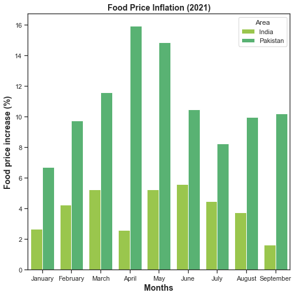

# Pandas FAO Data Report
### Description:
Data regarding the food inflation was downloaded fron the FAO stat. Different functions of Pandas library were used to rearrange, and to evaluate the basic statistical and methematical parameters of the data. Bargraph showing the difference in food price increase between India and Pakistan in 2021 was made.

## Importing libraries


```python
import pandas as pd
import numpy as np
import seaborn as sns
import matplotlib.pyplot as plt
```

## Importing data


```python
x1=pd.read_csv("food.csv")
x1.head()
```


<div>
<style scoped>
    .dataframe tbody tr th:only-of-type {
        vertical-align: middle;
    }

    .dataframe tbody tr th {
        vertical-align: top;
    }

    .dataframe thead th {
        text-align: right;
    }
</style>
<table border="1" class="dataframe">
  <thead>
    <tr style="text-align: right;">
      <th></th>
      <th>Domain</th>
      <th>Area</th>
      <th>Year</th>
      <th>Item</th>
      <th>Months</th>
      <th>Unit</th>
      <th>Value</th>
    </tr>
  </thead>
  <tbody>
    <tr>
      <th>0</th>
      <td>Consumer Price Indices</td>
      <td>India</td>
      <td>2021</td>
      <td>Food price inflation</td>
      <td>January</td>
      <td>%</td>
      <td>2.671010</td>
    </tr>
    <tr>
      <th>1</th>
      <td>Consumer Price Indices</td>
      <td>India</td>
      <td>2021</td>
      <td>Food price inflation</td>
      <td>February</td>
      <td>%</td>
      <td>4.252492</td>
    </tr>
    <tr>
      <th>2</th>
      <td>Consumer Price Indices</td>
      <td>India</td>
      <td>2021</td>
      <td>Food price inflation</td>
      <td>March</td>
      <td>%</td>
      <td>5.238415</td>
    </tr>
    <tr>
      <th>3</th>
      <td>Consumer Price Indices</td>
      <td>India</td>
      <td>2021</td>
      <td>Food price inflation</td>
      <td>April</td>
      <td>%</td>
      <td>2.597403</td>
    </tr>
    <tr>
      <th>4</th>
      <td>Consumer Price Indices</td>
      <td>India</td>
      <td>2021</td>
      <td>Food price inflation</td>
      <td>May</td>
      <td>%</td>
      <td>5.239031</td>
    </tr>
  </tbody>
</table>
</div>


## Groupby data


```python
x1.groupby(["Months","Area"]).mean()
```


<div>
<style scoped>
    .dataframe tbody tr th:only-of-type {
        vertical-align: middle;
    }

    .dataframe tbody tr th {
        vertical-align: top;
    }

    .dataframe thead th {
        text-align: right;
    }
</style>
<table border="1" class="dataframe">
  <thead>
    <tr style="text-align: right;">
      <th></th>
      <th></th>
      <th>Year</th>
      <th>Value</th>
    </tr>
    <tr>
      <th>Months</th>
      <th>Area</th>
      <th></th>
      <th></th>
    </tr>
  </thead>
  <tbody>
    <tr>
      <th rowspan="2" valign="top">April</th>
      <th>India</th>
      <td>2021.0</td>
      <td>2.597403</td>
    </tr>
    <tr>
      <th>Pakistan</th>
      <td>2021.0</td>
      <td>15.914037</td>
    </tr>
    <tr>
      <th rowspan="2" valign="top">August</th>
      <th>India</th>
      <td>2021.0</td>
      <td>3.734177</td>
    </tr>
    <tr>
      <th>Pakistan</th>
      <td>2021.0</td>
      <td>9.963327</td>
    </tr>
    <tr>
      <th rowspan="2" valign="top">February</th>
      <th>India</th>
      <td>2021.0</td>
      <td>4.252492</td>
    </tr>
    <tr>
      <th>Pakistan</th>
      <td>2021.0</td>
      <td>9.740263</td>
    </tr>
    <tr>
      <th rowspan="2" valign="top">January</th>
      <th>India</th>
      <td>2021.0</td>
      <td>2.671010</td>
    </tr>
    <tr>
      <th>Pakistan</th>
      <td>2021.0</td>
      <td>6.679107</td>
    </tr>
    <tr>
      <th rowspan="2" valign="top">July</th>
      <th>India</th>
      <td>2021.0</td>
      <td>4.458599</td>
    </tr>
    <tr>
      <th>Pakistan</th>
      <td>2021.0</td>
      <td>8.233434</td>
    </tr>
    <tr>
      <th rowspan="2" valign="top">June</th>
      <th>India</th>
      <td>2021.0</td>
      <td>5.584416</td>
    </tr>
    <tr>
      <th>Pakistan</th>
      <td>2021.0</td>
      <td>10.475956</td>
    </tr>
    <tr>
      <th rowspan="2" valign="top">March</th>
      <th>India</th>
      <td>2021.0</td>
      <td>5.238415</td>
    </tr>
    <tr>
      <th>Pakistan</th>
      <td>2021.0</td>
      <td>11.580484</td>
    </tr>
    <tr>
      <th rowspan="2" valign="top">May</th>
      <th>India</th>
      <td>2021.0</td>
      <td>5.239031</td>
    </tr>
    <tr>
      <th>Pakistan</th>
      <td>2021.0</td>
      <td>14.827254</td>
    </tr>
    <tr>
      <th rowspan="2" valign="top">September</th>
      <th>India</th>
      <td>2021.0</td>
      <td>1.610905</td>
    </tr>
    <tr>
      <th>Pakistan</th>
      <td>2021.0</td>
      <td>10.210293</td>
    </tr>
  </tbody>
</table>
</div>


## Basic statistical parameters


```python
x1.describe()
```


<div>
<style scoped>
    .dataframe tbody tr th:only-of-type {
        vertical-align: middle;
    }

    .dataframe tbody tr th {
        vertical-align: top;
    }

    .dataframe thead th {
        text-align: right;
    }
</style>
<table border="1" class="dataframe">
  <thead>
    <tr style="text-align: right;">
      <th></th>
      <th>Year</th>
      <th>Value</th>
    </tr>
  </thead>
  <tbody>
    <tr>
      <th>count</th>
      <td>18.0</td>
      <td>18.000000</td>
    </tr>
    <tr>
      <th>mean</th>
      <td>2021.0</td>
      <td>7.389478</td>
    </tr>
    <tr>
      <th>std</th>
      <td>0.0</td>
      <td>4.196117</td>
    </tr>
    <tr>
      <th>min</th>
      <td>2021.0</td>
      <td>1.610905</td>
    </tr>
    <tr>
      <th>25%</th>
      <td>2021.0</td>
      <td>4.304019</td>
    </tr>
    <tr>
      <th>50%</th>
      <td>2021.0</td>
      <td>6.131761</td>
    </tr>
    <tr>
      <th>75%</th>
      <td>2021.0</td>
      <td>10.148551</td>
    </tr>
    <tr>
      <th>max</th>
      <td>2021.0</td>
      <td>15.914037</td>
    </tr>
  </tbody>
</table>
</div>


## Overall mean of the data


```python
x1.mean(numeric_only=True)
```


    Year     2021.000000
    Value       7.389478
    dtype: float64


## Counting number of values (Area wise)


```python
x1.value_counts(["Area"])
```


    Area    
    India       9
    Pakistan    9
    dtype: int64


## Mean values based on the countries


```python
x1.groupby(["Area"]).mean()
```


<div>
<style scoped>
    .dataframe tbody tr th:only-of-type {
        vertical-align: middle;
    }

    .dataframe tbody tr th {
        vertical-align: top;
    }

    .dataframe thead th {
        text-align: right;
    }
</style>
<table border="1" class="dataframe">
  <thead>
    <tr style="text-align: right;">
      <th></th>
      <th>Year</th>
      <th>Value</th>
    </tr>
    <tr>
      <th>Area</th>
      <th></th>
      <th></th>
    </tr>
  </thead>
  <tbody>
    <tr>
      <th>India</th>
      <td>2021.0</td>
      <td>3.931828</td>
    </tr>
    <tr>
      <th>Pakistan</th>
      <td>2021.0</td>
      <td>10.847128</td>
    </tr>
  </tbody>
</table>
</div>


## Groupby based on Area and Months


```python
x1.groupby(["Area","Months"]).mean()
```


<div>
<style scoped>
    .dataframe tbody tr th:only-of-type {
        vertical-align: middle;
    }

    .dataframe tbody tr th {
        vertical-align: top;
    }

    .dataframe thead th {
        text-align: right;
    }
</style>
<table border="1" class="dataframe">
  <thead>
    <tr style="text-align: right;">
      <th></th>
      <th></th>
      <th>Year</th>
      <th>Value</th>
    </tr>
    <tr>
      <th>Area</th>
      <th>Months</th>
      <th></th>
      <th></th>
    </tr>
  </thead>
  <tbody>
    <tr>
      <th rowspan="9" valign="top">India</th>
      <th>April</th>
      <td>2021.0</td>
      <td>2.597403</td>
    </tr>
    <tr>
      <th>August</th>
      <td>2021.0</td>
      <td>3.734177</td>
    </tr>
    <tr>
      <th>February</th>
      <td>2021.0</td>
      <td>4.252492</td>
    </tr>
    <tr>
      <th>January</th>
      <td>2021.0</td>
      <td>2.671010</td>
    </tr>
    <tr>
      <th>July</th>
      <td>2021.0</td>
      <td>4.458599</td>
    </tr>
    <tr>
      <th>June</th>
      <td>2021.0</td>
      <td>5.584416</td>
    </tr>
    <tr>
      <th>March</th>
      <td>2021.0</td>
      <td>5.238415</td>
    </tr>
    <tr>
      <th>May</th>
      <td>2021.0</td>
      <td>5.239031</td>
    </tr>
    <tr>
      <th>September</th>
      <td>2021.0</td>
      <td>1.610905</td>
    </tr>
    <tr>
      <th rowspan="9" valign="top">Pakistan</th>
      <th>April</th>
      <td>2021.0</td>
      <td>15.914037</td>
    </tr>
    <tr>
      <th>August</th>
      <td>2021.0</td>
      <td>9.963327</td>
    </tr>
    <tr>
      <th>February</th>
      <td>2021.0</td>
      <td>9.740263</td>
    </tr>
    <tr>
      <th>January</th>
      <td>2021.0</td>
      <td>6.679107</td>
    </tr>
    <tr>
      <th>July</th>
      <td>2021.0</td>
      <td>8.233434</td>
    </tr>
    <tr>
      <th>June</th>
      <td>2021.0</td>
      <td>10.475956</td>
    </tr>
    <tr>
      <th>March</th>
      <td>2021.0</td>
      <td>11.580484</td>
    </tr>
    <tr>
      <th>May</th>
      <td>2021.0</td>
      <td>14.827254</td>
    </tr>
    <tr>
      <th>September</th>
      <td>2021.0</td>
      <td>10.210293</td>
    </tr>
  </tbody>
</table>
</div>


## Bar graph


```python
plt.figure(figsize=(8,8))
sns.set(style="ticks")
sns.set_palette(sns.color_palette("viridis_r"))
sns.barplot(x="Months", y="Value", hue="Area", data=x1)
plt.title("Food Price Inflation (2021)", size=14, weight="bold")
plt.xlabel("Months", size=14, weight="bold")
plt.xlabel("Months", size=14, weight="bold")
plt.xlabel("Months", size=14, weight="bold")
plt.ylabel("Food price increase (%)",size=14, weight="bold" )

```


    Text(0, 0.5, 'Food price increase (%)')


    

    


## Interpretation
The grapdh shows the comparison in food prices increase between India and Pakistan in 2021. It is concluded from the graph that increase in food prices from january to september 2021 is much higher in Pakistan as compare to India. Apparently, maximum percentage increase in food prices in Pakistan (15.91%) was recorded in the month of April while it was much lower in the case of India (2.59%). In the case of India, the highest recorded percentage in food prices was in the month of June (5.58%). However, both countries showed significant differences in terms of food price inflation.
